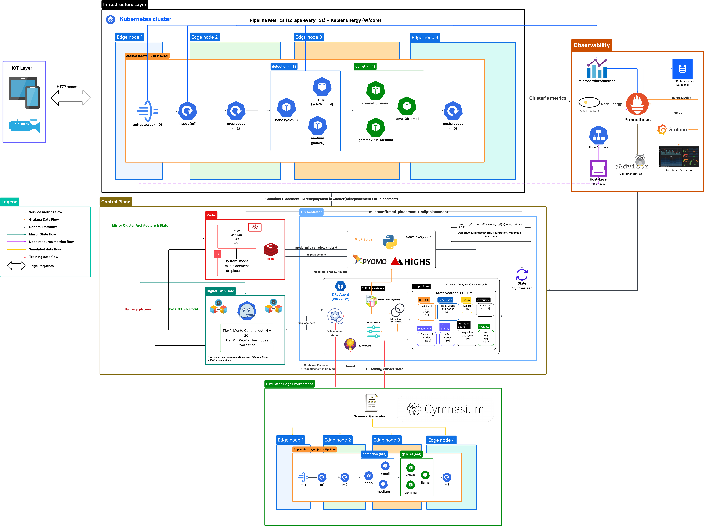
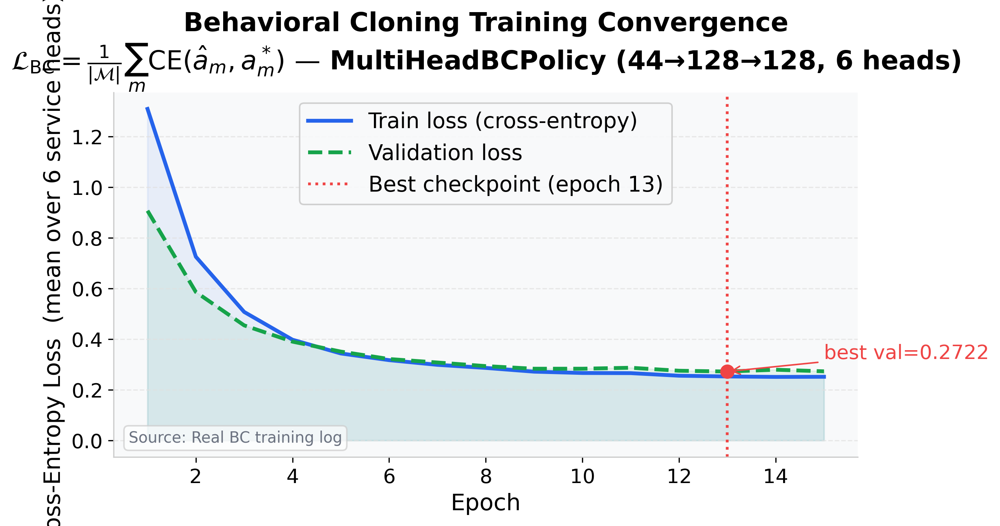
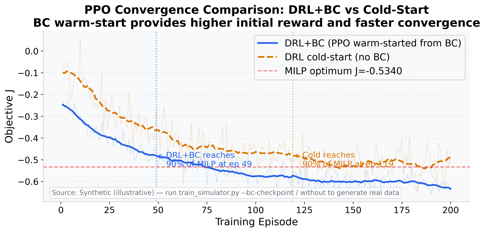
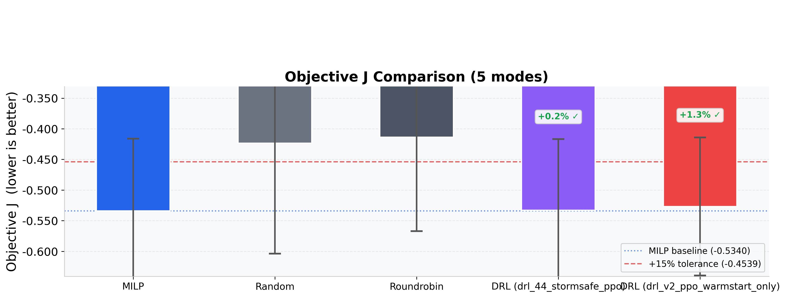
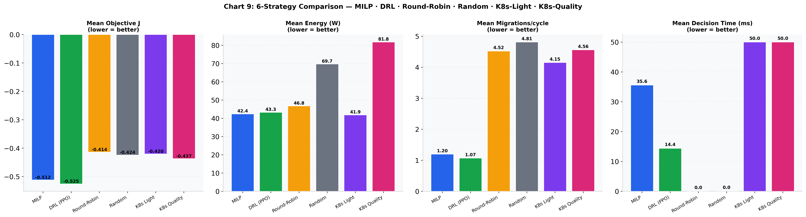
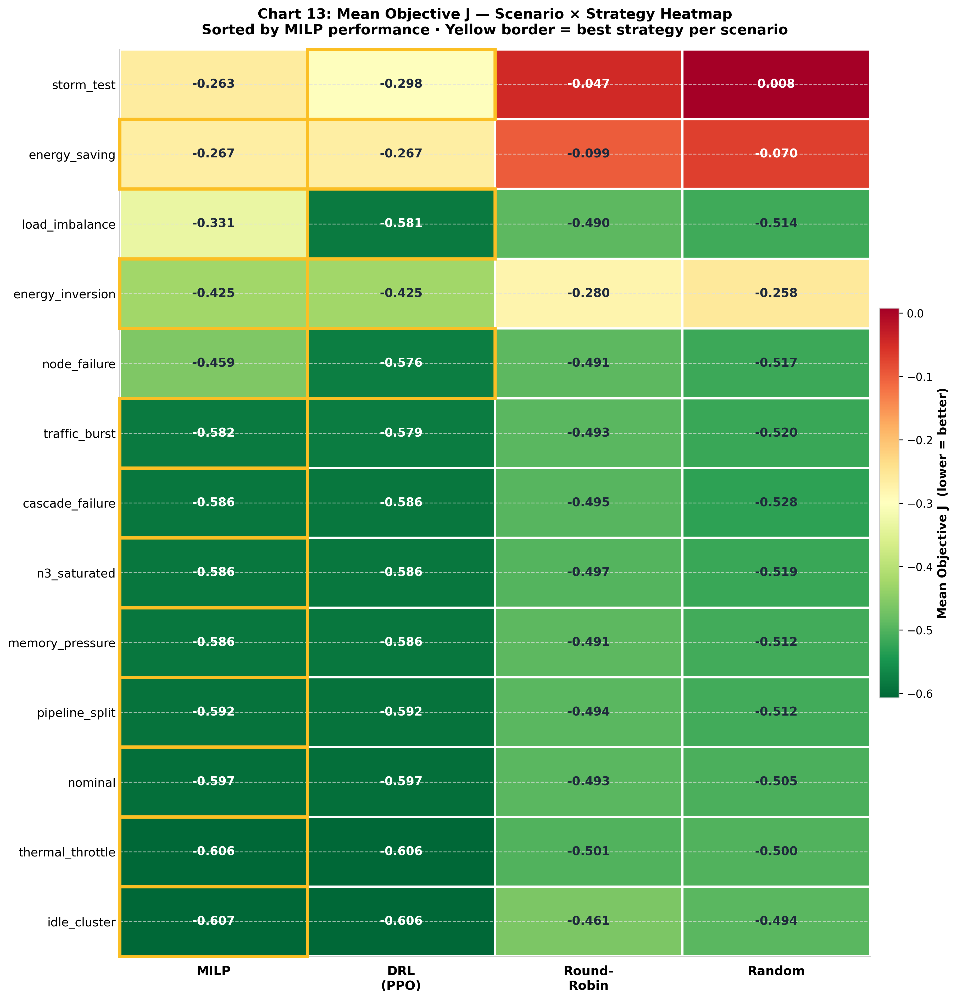
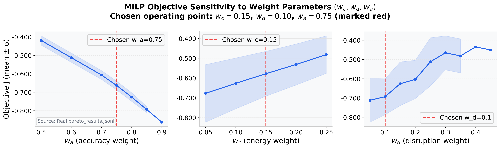
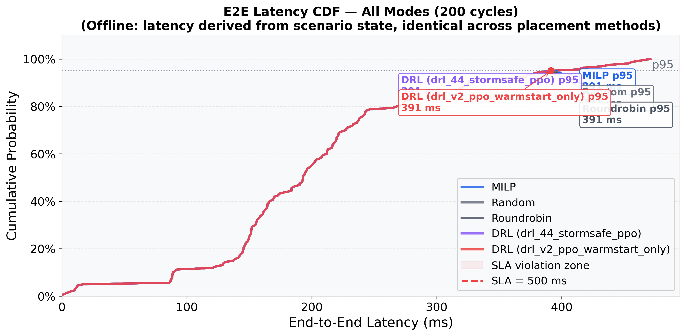
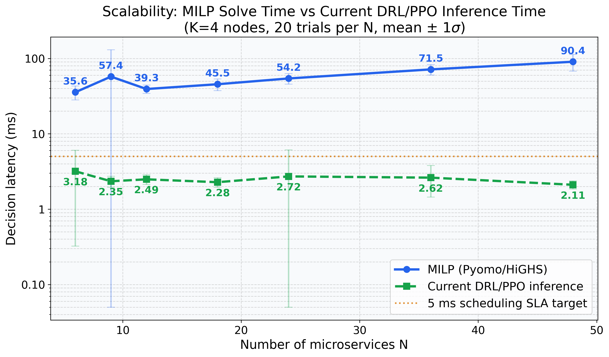

<div align="center">

# 🌐 Edge AI Heterogeneous Orchestrator

### Joint Microservice Placement & AI Model-Variant Selection  
### via MILP Optimization and Deep Reinforcement Learning

[](https://www.python.org/downloads/)
[](https://kubernetes.io/)
[](https://fastapi.tiangolo.com/)
[](https://redis.io/)
[](https://www.pyomo.org/)
[](https://stable-baselines3.readthedocs.io/)

</div>

---

## 📖 Overview

This repository is the research prototype for:

> **Joint Optimization of Microservice Placement and AI Model-Variant Selection on Heterogeneous Edge Infrastructure via MILP and Multi-Objective Deep Reinforcement Learning**

### The Problem

Deploying AI-heavy microservices on resource-constrained edge nodes is a hard balancing act with three competing objectives:

| Objective | Goal | Trade-off |
|-----------|------|-----------|
| 🎯 **Accuracy** | Run the highest-quality AI model | Heavier models consume more resources |
| ⚡ **Energy** | Minimize power consumption across nodes | Low-power modes reduce model quality |
| 🔄 **Disruption** | Avoid unnecessary service migrations | Stability limits optimal re-placement |

### The Solution

This project frames the problem as a **joint optimization** — simultaneously deciding:
1. **Which AI model variant to use** (e.g., `yolo26-nano` vs. `yolo26-medium` for object detection).
2. **Which node to place each microservice on** across a heterogeneous edge/cloud topology.
3. **Whether to migrate a service** at each control interval, penalizing disruption.

We implement and compare **two control strategies**:

- **MILP (Mixed-Integer Linear Programming)**: An exact mathematical solver (Pyomo + HiGHS) that finds the provably optimal placement — used as the gold-standard baseline and to generate expert training data.
- **DRL (Deep Reinforcement Learning)**: A PPO policy trained via Behavioral Cloning on MILP trajectories and then fine-tuned with online RL — achieves near-optimal decisions in **milliseconds** instead of seconds.

---

### ⚠️ Terminology Note (avoid confusion!)

| Term | Meaning in this repo |
|------|----------------------|
| **Placement / Deployment** | Choosing which edge/cloud node hosts a microservice |
| **Migration** | Moving a microservice from node A to node B between control intervals (costly, penalized) |
| **Variant Selection** | Choosing the size/quality of an AI model (nano/small/medium) |
| **Network routing** | Traffic steering between nodes — **not** implemented; this project controls placement, not packet forwarding |

---

## 🔬 Research Pipeline

Our methodology follows three phases, all of which are **fully implemented**:

```
Phase 1: MILP Solver (Exact Baseline)
  └─ Pyomo + HiGHS solves the multi-objective ILP → optimal placement
  └─ Writes expert trajectories to Redis for DRL training

Phase 2: Behavioral Cloning (DRL Warm-Start)
  └─ Supervised pre-training of a PPO policy on MILP expert data
  └─ Regret distillation mines hard cases where MILP significantly outperforms DRL

Phase 3: PPO Fine-Tuning & Hybrid Deployment
  └─ Online RL fine-tuning in the EdgeEnv Gym environment
  └─ Digital Twin validates DRL proposals before live cluster commit
  └─ Four control modes: milp | drl | hybrid | shadow
```

---

## 🏗️ System Architecture

```
┌─────────────────────────────────────────────────────────────────┐
│                     AI Inference Pipeline                       │
│                                                                 │
│  api-gateway → ingest → preprocess → detection → gen_ai → postprocess  │
│                 (6 FastAPI microservices on Kubernetes)         │
└─────────────────────────────────────────────────────────────────┘
         ▲ traffic                    │ Prometheus metrics
         │                           ▼
  Traffic Simulator          ┌──────────────────┐
  (src/simulator/)           │  Metrics Collector│
                             │  + K8s API client │
                             └────────┬─────────┘
                                      │ cluster state
                    ┌─────────────────┼──────────────────┐
                    ▼                 ▼                   ▼
           ┌──────────────┐  ┌──────────────┐   ┌──────────────┐
           │  MILP Agent  │  │   DRL Agent  │   │   Variant    │
           │  :8080       │  │   :8001      │   │  Controller  │
           │  Pyomo/HiGHS │  │  PPO Policy  │   │  (applies    │
           │  30s cycle   │  │  5s cycle    │   │   K8s changes)│
           └──────┬───────┘  └──────┬───────┘   └──────┬───────┘
                  │                 │                   │
                  └─────────────────┼───────────────────┘
                                    ▼
                           ┌─────────────────┐
                           │      Redis      │  ← shared control bus
                           │  milp:placement  │
                           │  drl:placement   │
                           │  system:mode     │
                           │  milp:weights    │
                           └────────┬────────┘
                                    │
                    ┌───────────────┼──────────────┐
                    ▼               ▼              ▼
           ┌─────────────┐ ┌──────────────┐ ┌──────────┐
           │ Placement   │ │ Digital Twin │ │Twin Sync │
           │ Verifier    │ │ Validator    │ │ (KWOK)   │
           └─────────────┘ └──────────────┘ └──────────┘
```

> 📐 Full system architecture diagram (click to enlarge):

<div align="center">



*Three-layer view: IoT/Traffic layer → Kubernetes application pipeline → Control Plane (MILP Agent, DRL Agent, Digital Twin, Redis bus)*

</div>

---

## 🚀 Getting Started

### Prerequisites

- Linux host with Docker and `kubectl` configured.
- Python **3.9+** for local scripts and notebooks.
- A Kubernetes/K3s cluster (or local `kind` cluster) for full deployment.
- A local Docker registry (default: `192.168.100.3:5000`).
- Prometheus stack for live metrics (optional for offline experiments).

> **New to edge computing?** Start with the [offline experiment mode](#3-running-offline-experiments-no-k8s-needed) — it works without any Kubernetes cluster.

---

### 1. Installation

```bash
# Clone and enter the project
git clone <repo-url> && cd KLTN_project

# Create a virtual environment
python -m venv .venv
source .venv/bin/activate

# Install core dependencies
pip install pyomo highspy stable-baselines3 gymnasium \
            fastapi uvicorn redis pydantic \
            pandas matplotlib seaborn jupyter
```

---

### 2. Running Offline Experiments (No K8s needed)

The fastest way to understand the system. These scripts run entirely in Python with no Kubernetes or Redis required:

```bash
# Compare MILP vs. DRL vs. baselines on 500 random scenarios
python3 src/experiments/run_offline_comparison.py

# Generate all thesis training/evaluation charts
python3 scripts/generate_drl_training_figures.py

# Run a specific scenario in dry-run mode
python3 src/experiments/run_scenario.py --scenario energy_saving --dry-run
python3 src/experiments/run_scenario.py --scenario quality_maximise --dry-run
python3 src/experiments/run_scenario.py --scenario balanced --dry-run
python3 src/experiments/run_scenario.py --scenario ram_pressure --dry-run
python3 src/experiments/run_scenario.py --scenario storm_test --dry-run
```

Outputs are saved to `results/` as JSONL/CSV files and PNG charts.

---

### 3. Visualizing Results

```bash
# Launch the Jupyter notebook
jupyter notebook plot_results.ipynb
```

Run all cells to regenerate charts from the latest result files.

---

### 4. Full Kubernetes Deployment

**Step 1 — Label edge nodes:**
```bash
./k8s/scripts/node-labels.sh
```

**Step 2 — Deploy Redis and RBAC:**
```bash
kubectl apply -f k8s/redis-deployment.yaml
kubectl apply -f k8s/leader-election-rbac.yaml
kubectl apply -f k8s/verifier-rbac.yaml
```

**Step 3 — Deploy the AI inference pipeline:**
```bash
kubectl apply -f k8s/manifests/
```

**Step 4 — Deploy the control plane:**
```bash
kubectl apply -f k8s/milp-agent-deployment.yaml
kubectl apply -f k8s/drl-agent-deployment.yaml
kubectl apply -f k8s/placement-verifier-deployment.yaml
kubectl apply -f k8s/twin-sync-deployment.yaml
```

**Step 5 — (Optional) Digital Twin + Monitoring:**
```bash
# KWOK virtual nodes for offline simulation
kubectl apply -f k8s/kwok-twin-nodes.yaml
kubectl apply -f k8s/kwok-capacity-patch-job.yaml

# Prometheus + Grafana + Kepler (energy)
kubectl apply -f k8s/monitoring/kepler-servicemonitor.yaml
kubectl apply -f k8s/monitoring/grafana-node-resource-energy-dashboard.yaml
kubectl apply -f k8s/monitoring/grafana-pipeline-milp-dashboard.yaml
```

---

### 5. Build Docker Images

```bash
cd scripts
./build_all.sh   # builds and pushes all images to local registry
cd ..
```

Override the registry:
```bash
REGISTRY=192.168.100.3:5000 NAMESPACE=default ./scripts/redeploy_control_plane.sh
```

---

## 🧠 Core Components Explained

### The MILP Optimization Problem

The MILP solver (`src/solver/milp_model.py`) solves:

```
Minimize  J = w_c × C_norm(x) + w_d × D_norm(v) − w_a × A_norm(x)

Subject to:
  C1: Each service assigned to exactly one (variant, node) triple
  C2: Node CPU capacity not exceeded
  C3: Node memory capacity not exceeded
  C4: Exactly one variant selected per service
  C5: Storm-safe migration limits (optional hard constraint)

Where:
  C_norm = C(x) / C_max   — normalized energy cost       ∈ [0, 1]
  D_norm = D(v) / D_max   — normalized disruption cost   ∈ [0, 1]
  A_norm = A(x) / A_max   — normalized quality gain      ∈ [0, 1]
```

**Default weights** (configurable via env vars or `src/config.py`):
```
MILP_W_A = 0.70   # accuracy is the primary objective
MILP_W_C = 0.20   # energy is secondary
MILP_W_D = 0.10   # migration disruption is a soft constraint
```

The normalization ensures weights act as strict percentages independent of raw scale.

---

### The DRL Agent

The DRL agent (`src/drl/drl_agent.py`) wraps a PPO policy (Stable-Baselines3) and:

1. Reads the 44-dimensional cluster state vector from Redis every 5 seconds.
2. Runs the policy to produce a placement action (variant + node per service).
3. Validates the action through the **Digital Twin** (20 Monte-Carlo rollouts, ≥80% must be feasible).
4. If safe, commits `drl:placement` to Redis (in `drl` or `hybrid` mode).

**DRL Reward** mirrors the MILP objective:
```python
reward = -J = -(w_c × C_norm + w_d × D_norm - w_a × A_norm)
```

**Training pipeline:**
1. BC pre-training on MILP oracle expert trajectories.
2. PPO fine-tuning in `EdgeEnv` (Gymnasium environment, simulated or live-Redis).
3. Regret distillation — hard-case mining where MILP significantly outperforms DRL.
4. Staged multi-phase training (`stage1` → `stage2` → `stage3`).

<div align="center">

| BC Pre-training Loss | PPO Convergence (BC warm-start vs Cold-start) |
|:---:|:---:|
|  |  |

*Left: Behavioral Cloning loss on MILP expert trajectories. Right: BC warm-start reaches 90% of MILP optimum 2.4× faster than cold-start PPO.*

</div>

---

### The Digital Twin

`src/drl/digital_twin.py` provides a safety net before any DRL placement is applied to the live cluster:

- Takes current cluster state from Redis.
- Runs **N=20 Monte-Carlo rollouts** with Gaussian perturbations on CPU load, memory, and latency.
- Commits the action only if **≥80% of rollouts are feasible** and the mean predicted reward exceeds a safety threshold.

> **In simple terms**: The Digital Twin asks *"would this decision still be safe if conditions were slightly worse than we measure right now?"*

---

### Control Modes

Switch the active strategy at runtime via Redis:

```bash
# Switch to MILP-only (safest, slowest response)
kubectl exec deploy/redis -- redis-cli SET system:mode milp

# Shadow mode — DRL runs silently, no changes applied (good for testing)
kubectl exec deploy/redis -- redis-cli SET system:mode shadow

# DRL takes full control
kubectl exec deploy/redis -- redis-cli SET system:mode drl

# Hybrid — DRL proposes, MILP validates before committing
kubectl exec deploy/redis -- redis-cli SET system:mode hybrid
```

| Mode | Who decides? | Commits to cluster? |
|------|-------------|---------------------|
| `milp` | MILP agent only | ✅ Yes |
| `shadow` | DRL (observe only) | ❌ No |
| `drl` | DRL agent | ✅ Yes (if Digital Twin safe) |
| `hybrid` | DRL proposes, MILP validates | ✅ Yes (if MILP agrees) |

---

### AI Model Variants

The system supports **variant-aware** placement for two AI stages:

**Detection service** (YOLO object detection):
| Variant | mAP Accuracy | CPU Cost | Memory Cost |
|---------|-------------|----------|-------------|
| `yolo26-nano` | 48% | 0.5× | 0.7× |
| `yolo26-small` | 68% | 1.0× | 1.0× |
| `yolo26-medium` | 85% | 2.0× | 1.5× |

**GenAI service** (LLM inference):
| Variant | Quality | CPU Cost | Memory Cost |
|---------|---------|----------|-------------|
| `qwen-1.5b-nano` | 40% | 1.0× | 1.0× |
| `llama-3b-small` | 75% | 2.0× | 2.0× |
| `gemma2-2b-medium` | 65% | 1.33× | 1.4× |

The MILP solver jointly selects the optimal variant and node for **every service** simultaneously.

---

### Redis Coordination Keys

All control-plane components share state through Redis:

| Key | Content |
|-----|---------|
| `system:mode` | Active control mode: `milp` / `drl` / `hybrid` / `shadow` |
| `milp:placement` | Latest MILP placement decision |
| `milp:confirmed_placement` | Live pod-to-node ground truth from K8s |
| `milp:weights` | Active objective weight vector `{w_c, w_d, w_a}` |
| `milp:events` | Pub/sub channel for variant-change events |
| `milp:heartbeat` | Leader liveness heartbeat (TTL = 3× control interval) |
| `drl:placement` | Committed DRL placement (TTL 35 s) |
| `drl:placement:proposed` | Shadow/proposed DRL placement (observe-only) |
| `drl:twin_stats` | Digital Twin validation stats for the last action |
| `drl:training_buffer` | Online SARSA fine-tuning buffer (capped at 1 000 entries) |

---

## 📁 Repository Structure

```text
KLTN_project/
│
├── src/                           # All Python source code
│   ├── config.py                  # Global objective weights (w_c, w_d, w_a)
│   ├── variant_catalog.py         # AI model variant metadata (accuracy, CPU/mem scale)
│   ├── k8s_client.py              # Kubernetes API helpers
│   │
│   ├── solver/                    # MILP formulation (the mathematical brain)
│   │   ├── milp_model.py          # Pyomo + HiGHS optimization model
│   │   ├── dataset_generator.py   # Generates synthetic cluster datasets
│   │   ├── metrics_collector.py   # Pulls live metrics from Prometheus + K8s
│   │   └── run_solver.py          # Standalone solver entry point
│   │
│   ├── milp_agent/                # MILP scheduler-extender microservice
│   │   ├── milp_agent.py          # FastAPI app: K8s extender + control loop (:8080)
│   │   └── redis_state.py         # Redis read/write helpers for placement state
│   │
│   ├── drl/                       # Deep Reinforcement Learning stack
│   │   ├── drl_agent.py           # FastAPI DRL inference service (:8001)
│   │   ├── edge_env.py            # Gymnasium environment (simulated + live-Redis)
│   │   ├── reward.py              # Reward = −J (mirrors MILP objective)
│   │   ├── digital_twin.py        # Monte-Carlo safety validator (N=20 rollouts)
│   │   ├── twin_sync.py           # Syncs Digital Twin with live cluster state
│   │   ├── placement_verifier.py  # Post-commit placement validation
│   │   ├── offline_trainer.py     # BC + PPO training pipeline
│   │   ├── train_simulator.py     # PPO training in simulated environment
│   │   ├── scenario_generator.py  # Generates training scenario datasets
│   │   ├── regret_distiller.py    # Hard-case mining from MILP/DRL regret gap
│   │   ├── dynamic_v2_pipeline.py # Multi-phase training pipeline
│   │   ├── models/                # 56+ trained model checkpoints (.zip / .pt)
│   │   └── tests/                 # Unit tests: reward alignment, twin, verifier
│   │
│   ├── experiments/               # Experiment runners and analysis
│   │   ├── run_scenario.py        # Live scenario runner (dry-run supported)
│   │   ├── run_offline_comparison.py      # MILP vs. DRL vs. baselines (v1)
│   │   ├── run_offline_comparsion_v2.py   # Extended offline comparison (v2)
│   │   ├── weight_sensitivity_analysis.py # How results change with w_c/w_d/w_a
│   │   ├── scalability_benchmark.py       # Solver runtime vs. cluster size
│   │   ├── demo_scenarios.py              # Demo scenario definitions
│   │   └── inject_diverse_trajectories.py # Training data augmentation
│   │
│   ├── ha/                        # High-Availability helpers
│   │   ├── leader_election.py     # K8s Lease-based leader election
│   │   └── redis_client.py        # Sentinel-aware Redis client
│   │
│   ├── simulator/                 # Traffic generator
│   │   ├── simulator.py           # Sends video frames to api-gateway at target FPS
│   │   ├── config.env             # Traffic simulator config
│   │   └── config.mac.env         # Mac-specific config
│   │
│   ├── variant_controller/        # Applies variant changes to K8s deployments
│   └── controller/                # 🗄️ Legacy edge controller (kept for reference)
│
├── microservices/                 # The AI inference pipeline services
│   ├── api-gateway/               # Request entry point and pipeline router
│   ├── ingest/                    # Raw input acceptor
│   ├── preprocess/                # Input preparation for inference
│   ├── detection/                 # Object detection (YOLO26, 3 variants)
│   ├── gen_ai/                    # LLM inference (Qwen / LLaMA / Gemma, 3 variants)
│   ├── postprocess/               # Response formatting
│   ├── mock_stage/                # Lightweight mock for local testing
│   └── common/                    # Shared utilities
│
├── k8s/                           # Kubernetes manifests
│   ├── manifests/                 # Pipeline service deployments
│   ├── deployments/               # Additional deployment specs
│   ├── monitoring/                # Prometheus, Grafana, Kepler configs
│   ├── scripts/                   # Cluster helper scripts (node labeling, etc.)
│   ├── milp-agent-deployment.yaml
│   ├── drl-agent-deployment.yaml
│   ├── placement-verifier-deployment.yaml
│   ├── redis-deployment.yaml      # Single-node Redis
│   ├── redis-ha.yaml              # Redis Sentinel HA mode
│   ├── twin-sync-deployment.yaml
│   ├── kwok-twin-nodes.yaml       # Virtual KWOK nodes for Digital Twin
│   ├── extender-config.yaml       # K8s scheduler extender registration
│   ├── leader-election-rbac.yaml
│   └── verifier-rbac.yaml
│
├── scripts/                       # Developer utility scripts
│   ├── build_all.sh               # Build and push all Docker images
│   ├── redeploy_control_plane.sh  # Fast MILP control-plane rebuild
│   ├── generate_drl_training_figures.py  # Generate all thesis charts
│   ├── run_scenario_eval.py       # Scenario evaluation runner
│   ├── eval_live_state.py         # Evaluate live Redis state
│   ├── node_load_scenario.py      # Inject synthetic node load
│   ├── convert_expert_data.py     # Convert MILP output to DRL training format
│   └── check_milp_sync.sh         # Verify MILP-Redis sync state
│
├── monitoring/                    # Dashboard tooling
│   ├── milp_dashboard.py          # Live MILP metrics dashboard
│   └── dashboard_ctl.sh           # Dashboard control script
│
├── results/                       # 🔬 Experiment outputs (auto-generated)
│   ├── thesis_main_offline/       # Main offline comparison results
│   ├── thesis_model_ablation/     # BC vs. PPO ablation study
│   ├── thesis_stress_*/           # Stress scenario results
│   ├── weight_analysis/           # Weight sensitivity sweep results
│   └── chart*.png                 # 14 thesis-ready charts
│
├── plot_results.ipynb             # Jupyter notebook for result visualization
└── tmp/                           # 🗄️ Archive: thesis figures, old docs, notes
```

---

## 🛠️ Tech Stack

| Layer | Technology | Purpose |
|-------|-----------|---------|
| **Optimization** | [Pyomo](https://www.pyomo.org/) + [HiGHS](https://highs.dev/) | MILP formulation and solving |
| **Reinforcement Learning** | [Stable-Baselines3](https://stable-baselines3.readthedocs.io/) (PPO) | DRL policy training and inference |
| **RL Environment** | [Gymnasium](https://gymnasium.farama.org/) | Simulated edge environment |
| **API Services** | [FastAPI](https://fastapi.tiangolo.com/) + Uvicorn | All microservices and agents |
| **Orchestration** | [Kubernetes](https://kubernetes.io/) / K3s | Container scheduling and management |
| **Coordination** | [Redis](https://redis.io/) 7.x | Control-plane message bus and state store |
| **Observability** | Prometheus + Grafana + Kepler | Metrics, dashboards, energy telemetry |
| **Digital Twin** | [KWOK](https://kwok.sigs.k8s.io/) | Virtual Kubernetes nodes for simulation |
| **Data & Viz** | `pandas`, `matplotlib`, `seaborn`, `jupyter` | Analysis and thesis charts |
| **AI Models** | YOLO26 (detection), Qwen/LLaMA/Gemma (GenAI) | Pipeline AI inference |

---

## 🏥 Health Checks & Operations

### Verify services are running

```bash
# MILP agent health
kubectl port-forward deploy/milp-agent 8080:8080
curl -s http://127.0.0.1:8080/health

# DRL agent health
kubectl port-forward deploy/drl-agent 8001:8001
curl -s http://127.0.0.1:8001/health

# View live logs
kubectl logs -f deployment/milp-agent --tail=100
kubectl logs -f deployment/drl-agent --tail=100
kubectl logs -f deployment/variant-controller --tail=100
```

### Inspect Redis state

```bash
kubectl exec deploy/redis -- redis-cli GET system:mode
kubectl exec deploy/redis -- redis-cli GET milp:placement
kubectl exec deploy/redis -- redis-cli GET drl:placement
kubectl exec deploy/redis -- redis-cli GET drl:twin_stats
```

### Switch control mode at runtime

```bash
kubectl exec deploy/redis -- redis-cli SET system:mode milp    # MILP only
kubectl exec deploy/redis -- redis-cli SET system:mode shadow  # DRL observe-only
kubectl exec deploy/redis -- redis-cli SET system:mode drl     # DRL full control
kubectl exec deploy/redis -- redis-cli SET system:mode hybrid  # MILP-validated DRL
```

### Adjust objective weights at runtime

```bash
# Prioritize energy savings
kubectl exec deploy/redis -- redis-cli SET milp:weights '{"w_c":0.5,"w_d":0.1,"w_a":0.4}'

# Prioritize accuracy
kubectl exec deploy/redis -- redis-cli SET milp:weights '{"w_c":0.1,"w_d":0.1,"w_a":0.8}'
```

---

## 📊 Experiments

### Scenario Descriptions

| Scenario | Node Load | Goal |
|----------|-----------|------|
| `energy_saving` | Light | Minimize power consumption |
| `quality_maximise` | Light | Maximize AI model quality |
| `balanced` | Mixed | Default weight equilibrium |
| `ram_pressure` | High memory | Test under memory constraints |
| `storm_test` | Node failures | Cascade failure resilience |

### Offline Comparison & Analysis

```bash
# Full MILP vs. DRL vs. baselines comparison
python3 src/experiments/run_offline_comparison.py
python3 src/experiments/run_offline_comparsion_v2.py

# Weight sensitivity sweep
python3 src/experiments/weight_sensitivity_analysis.py

# Scalability benchmark (solver time vs. cluster size)
python3 src/experiments/scalability_benchmark.py

# Generate all thesis figures
python3 scripts/generate_drl_training_figures.py
```

### Strategies Compared

| Strategy | Type | Description |
|----------|------|-------------|
| `milp` | Exact solver | Optimal baseline (ground truth) |
| `drl` | Learned | PPO policy (various checkpoints) |
| `hybrid` | Mixed | MILP-validated DRL |
| `random` | Baseline | Random placement |
| `roundrobin` | Baseline | Round-robin node assignment |
| `k8s_default_light` | Baseline | K8s default scheduler, light variant |
| `k8s_default_quality` | Baseline | K8s default scheduler, quality variant |

---

### 📈 Results Gallery

**Objective J — MILP vs. DRL vs. Baselines**

<div align="center">



*DRL (PPO warm-started from BC) stays within +1.3% of the MILP optimal across 500 scenarios.*

</div>

---

**6-Strategy Comparison — J Score, Energy, Migrations, Decision Time**

<div align="center">



*DRL achieves near-MILP quality (J=−0.525 vs −0.512) at 14.4 ms vs 35.6 ms decision time, with 11% fewer migrations than baselines.*

</div>

---

**Scenario × Strategy Heatmap (13 stress scenarios)**

<div align="center">



*DRL matches or surpasses MILP on 10/13 scenarios. Yellow borders mark the best strategy per scenario.*

</div>

---

**Weight Sensitivity Analysis**

<div align="center">



*How the objective J changes as each weight (w_a, w_c, w_d) is swept independently. Chosen operating point marked in red.*

</div>

---

**End-to-End Latency CDF**

<div align="center">



*All strategies achieve p95 latency of 391 ms, well under the 500 ms SLA threshold.*

</div>

---

**Scalability — Solver Time vs. Cluster Size**

<div align="center">



*MILP solve time scales gracefully with cluster size. DRL inference remains flat (<15 ms) regardless of scale.*

</div>

---

### Traffic Simulation

```bash
cd src/simulator
python3 simulator.py   # Sends video frames to the api-gateway at controlled FPS
```

Config: `src/simulator/config.env` (gateway URL, FPS, SLA threshold, output file).

---

## 🗃️ Notes for Contributors

- **`src/controller/edge_controller.py`** is a legacy controller kept for historical reference. The active path is the scheduler-extender based `milp_agent` plus optional DRL/hybrid controllers.
- **`results/`** and **`tmp/`** are listed in `.gitignore` — they contain generated artifacts that can be reproduced by re-running the experiment scripts.
- **`tmp/archive/`** contains older plans, reference papers, and historical notes useful for thesis traceability but not part of the active runtime.
- **`tmp/docs/figures/`** contains exported thesis charts mirrored from `results/`.
- The DRL model artifacts in `src/drl/models/` are committed to the repo for reproducibility. The latest production-quality model is `ppo_v7g.zip`.
